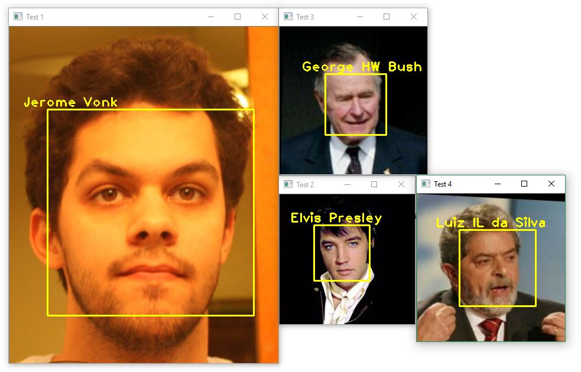

# Face recognition example

based on https://www.superdatascience.com/opencv-face-recognition/

Images by: the web, [sklearn eigenface example](http://scikit-learn.org/0.15/auto_examples/applications/face_recognition.html) and me.

## Installation instructions

### On Windows

- Install Python 3
- `pip install opencv-contrib-python`

### On Linux

- Run the installation script from [here](https://milq.github.io/install-opencv-ubuntu-debian/)

## Running the code

Simply run **face_recognition.py.**

There are 48 images in the training data (12 for each person) and 4 pictures in the test data.

The script trains a LBPH FaceRecognizer with the 48 pictures and then predicts who's in the test pictures. 

Try with your own pictures!
